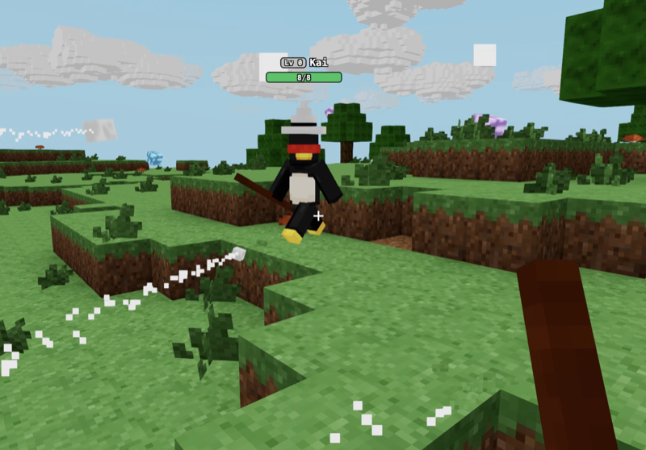

# bongle-wizard-game

A multiplayer wizard arena built with [bongle](https://github.com/isaac-mason/bongle), the multiplayer voxel game engine for the web. Fork it, remix it, make it your own.

[](https://codespaces.new/isaac-mason/bongle-wizard-game)

Click the GitHub Codespaces badge above to open this project in a one-click cloud dev environment. It boots a Linux container, installs dependencies, and starts the editor. Open the forwarded `:3002` port to start building.

## Run locally

```sh
git clone https://github.com/isaac-mason/bongle-wizard-game.git
cd bongle-wizard-game
npm install
npm run edit
```

The editor runs on http://localhost:3002. Edit the game code in `src/` and see your changes live.

## Commands

```sh
npm run edit    # start the editor
npm run build   # build into dist/bundle.zip
npm run start   # serve a built dist/ locally
```

## Project layout

```
src/        game code (index.ts is the entry point)
content/    scenes authored in the editor
assets/     source models and sounds
blockbench/ Blockbench source files for the models
```
